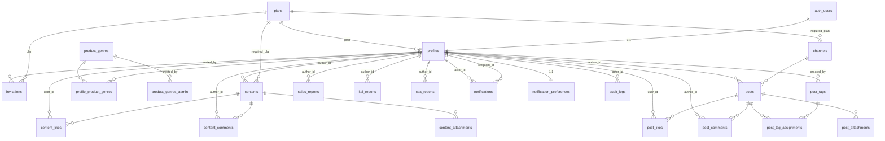

# データモデル詳細（MVP v0.1）

**最終更新**: 2026-05-26
**対象**: 谷脇式マーケティングCAMP コミュニティ MVP
**前提**: PostgreSQL 15+（Supabase Cloud 互換）
**目的**: そのまま Supabase の SQL Editor / `psql` で実行可能な DDL と seed を提供する

> 本書は `.claude/plans/foods-community-design.plan.md` §3「データモデル」、§2「ユーザー・ロール・プラン」、§19「MVP 機能スコープ確定リスト」の SQL 詳細展開である。RLS ポリシーの実装は別ドキュメント（`rls-policies.md`、未作成）で扱う。

---

## 目次

1. [前提・命名規約](#1-前提命名規約)
2. [ER 図](#2-er-図)
3. [拡張・共通関数](#3-拡張共通関数)
4. [マスタテーブル DDL](#4-マスタテーブル-ddl)
   - 4.1 `plans`
   - 4.2 `product_genres`
   - 4.3 `channels`
5. [認証・ユーザー系 DDL](#5-認証ユーザー系-ddl)
   - 5.1 `profiles`
   - 5.2 `profile_product_genres`
   - 5.3 `invitations`
6. [コンテンツ系（お知らせ）DDL](#6-コンテンツ系お知らせddl)
   - 6.1 `contents`
   - 6.2 `content_attachments`
   - 6.3 `content_likes`
   - 6.4 `content_comments`
7. [掲示板系 DDL](#7-掲示板系-ddl)
   - 7.1 `posts`
   - 7.2 `post_attachments`
   - 7.3 `post_likes`
   - 7.4 `post_comments`
   - 7.5 `post_tags`
   - 7.6 `post_tag_assignments`
8. [月次データ系 DDL](#8-月次データ系-ddl)
   - 8.1 `sales_reports`
   - 8.2 `kpi_reports`
   - 8.3 `cpa_reports`
9. [通知系 DDL](#9-通知系-ddl)
   - 9.1 `notifications`
   - 9.2 `notification_preferences`
10. [監査ログ DDL](#10-監査ログ-ddl)
11. [インデックス定義](#11-インデックス定義)
12. [トリガー・関数](#12-トリガー関数)
13. [初期 seed](#13-初期-seed)
14. [v0.2 で追加予定のテーブル](#14-v02-で追加予定のテーブル)

---

## 1. 前提・命名規約

| 項目 | 規約 |
|---|---|
| 文字コード | UTF-8 |
| ID 型 | `uuid`（`gen_random_uuid()` で生成）／マスタは `text` PK |
| 日時型 | `timestamptz`（タイムゾーン保持） |
| 文字列 | 原則 `text`（VARCHAR は使わない） |
| 真偽値 | `boolean` |
| 数値 | 金額・率は `numeric`、件数は `integer` |
| JSON | `jsonb`（GIN インデックス可能） |
| 命名 | テーブル名は複数形・スネークケース、カラムは単数形・スネークケース |
| 論理削除 | `deleted_at timestamptz` nullable で表現 |
| タイムスタンプ | `created_at` / `updated_at` を必ず保持。`updated_at` はトリガーで自動更新 |
| FK | `ON DELETE` 挙動を必ず明示 |
| RLS | 全テーブルで有効化（本書末尾で `ALTER TABLE ... ENABLE ROW LEVEL SECURITY`） |

### 1.1 列挙値（CHECK 制約で表現）

| 領域 | 値 |
|---|---|
| `profiles.role` | `'admin'` / `'member'` |
| `profiles.status` | `'active'` / `'suspended'` / `'deleted'` / `'hard_deleted'` |
| `contents.category` | `'important'` / `'news'` / `'column'` / `'seminar'` |
| `contents.status` | `'draft'` / `'published'` |
| `*_attachments.attachment_type` | `'image'` / `'video_embed'` |
| `*_attachments.external_provider` | `'youtube'` |
| `kpi_reports.unit` | `'%'` / `'件'` / `'円'` / `'人'` / `'回'` |

プランは `plans` マスタテーブルへの FK で表現（`'trial'` / `'standard'` / `'premium'`）。
販売ジャンル・チャンネル・タグも同様にマスタテーブルで表現。

---

## 2. ER 図



> 注: `auth_users` は Supabase の `auth.users` テーブルを表す（外部スキーマ）。`product_genres_admin` は ER 上の便宜的な表現で実体は `product_genres.created_by` の自己 FK。

---

## 3. 拡張・共通関数

```sql
-- ============================================================
-- 拡張機能
-- ============================================================
CREATE EXTENSION IF NOT EXISTS "pgcrypto";   -- gen_random_uuid()
CREATE EXTENSION IF NOT EXISTS "citext";     -- 大文字小文字無視テキスト（メールアドレス用）

-- ============================================================
-- 共通: updated_at 自動更新トリガー関数
-- ============================================================
CREATE OR REPLACE FUNCTION public.set_updated_at()
RETURNS trigger
LANGUAGE plpgsql
AS $$
BEGIN
  NEW.updated_at := now();
  RETURN NEW;
END;
$$;

COMMENT ON FUNCTION public.set_updated_at() IS
  '更新時に updated_at を now() に書き換える共通トリガー関数';
```

---

## 4. マスタテーブル DDL

マスタは FK 参照先になるため最初に作成する。

### 4.1 `plans`

```sql
CREATE TABLE public.plans (
  id              text         PRIMARY KEY,
  label           text         NOT NULL,
  price_amount    numeric(10,0) NOT NULL CHECK (price_amount >= 0),
  tax_included    boolean      NOT NULL DEFAULT true,
  display_price   text         NOT NULL,
  rank            integer      NOT NULL UNIQUE,
  description     text         NOT NULL DEFAULT '',
  features        jsonb        NOT NULL DEFAULT '[]'::jsonb,
  sort_order      integer      NOT NULL DEFAULT 0,
  is_active       boolean      NOT NULL DEFAULT true,
  created_at      timestamptz  NOT NULL DEFAULT now(),
  updated_at      timestamptz  NOT NULL DEFAULT now(),
  CONSTRAINT plans_id_check CHECK (id IN ('trial','standard','premium'))
);

COMMENT ON TABLE  public.plans                  IS '料金プランのマスタ（ハードコード seed）';
COMMENT ON COLUMN public.plans.id               IS '''trial'' / ''standard'' / ''premium''';
COMMENT ON COLUMN public.plans.price_amount     IS '月額の数値（円・税込）';
COMMENT ON COLUMN public.plans.tax_included     IS '税込フラグ（MVP は全て true）';
COMMENT ON COLUMN public.plans.display_price    IS 'UI に表示する完全表記文字列（例: 「月額 25,000 円（税込）」）';
COMMENT ON COLUMN public.plans.rank             IS '権限比較用の数値（0=trial, 1=standard, 2=premium）';
COMMENT ON COLUMN public.plans.features         IS 'UI 表示用の機能リスト（jsonb 配列）';

CREATE TRIGGER trg_plans_updated_at
  BEFORE UPDATE ON public.plans
  FOR EACH ROW EXECUTE FUNCTION public.set_updated_at();
```

### 4.2 `product_genres`

```sql
CREATE TABLE public.product_genres (
  id            text         PRIMARY KEY,
  label         text         NOT NULL,
  icon_emoji    text         NOT NULL,
  description   text,
  sort_order    integer      NOT NULL DEFAULT 0,
  is_active     boolean      NOT NULL DEFAULT true,
  created_by    uuid         REFERENCES public.profiles(id) ON DELETE SET NULL ON UPDATE CASCADE,
  created_at    timestamptz  NOT NULL DEFAULT now(),
  updated_at    timestamptz  NOT NULL DEFAULT now()
);

COMMENT ON TABLE  public.product_genres            IS '販売ジャンルのマスタ（admin 管理）';
COMMENT ON COLUMN public.product_genres.id         IS '''vegetable'' / ''fruit'' などのスラッグ';
COMMENT ON COLUMN public.product_genres.icon_emoji IS '表示用絵文字（例: 🥬）';
COMMENT ON COLUMN public.product_genres.is_active  IS '論理削除フラグ';

CREATE TRIGGER trg_product_genres_updated_at
  BEFORE UPDATE ON public.product_genres
  FOR EACH ROW EXECUTE FUNCTION public.set_updated_at();
```

> `created_by` は `profiles` への FK だが、`profiles` がまだ未作成のため後方参照になる。本書では DDL を「マスタ → profiles → 残り」の順で並べるため、`profiles` 作成後に `ALTER TABLE` で FK を付ける構成にしてもよいが、Supabase 環境では宣言順は問題にならない（同一マイグレーション内で双方の FK を解決できる）。本書は読みやすさ優先で先に書く。

### 4.3 `channels`

```sql
CREATE TABLE public.channels (
  id                    text         PRIMARY KEY,
  label                 text         NOT NULL,
  description           text,
  icon_emoji            text,
  color                 text         NOT NULL DEFAULT '#c05e3f',
  required_plan         text         NOT NULL REFERENCES public.plans(id) ON DELETE RESTRICT ON UPDATE CASCADE,
  only_admin_can_post   boolean      NOT NULL DEFAULT false,
  trial_preview_count   integer      CHECK (trial_preview_count IS NULL OR trial_preview_count >= 0),
  sort_order            integer      NOT NULL DEFAULT 0,
  is_active             boolean      NOT NULL DEFAULT true,
  created_by            uuid         REFERENCES public.profiles(id) ON DELETE SET NULL ON UPDATE CASCADE,
  created_at            timestamptz  NOT NULL DEFAULT now(),
  updated_at            timestamptz  NOT NULL DEFAULT now()
);

COMMENT ON TABLE  public.channels                     IS '掲示板チャンネル マスタ（admin 管理）';
COMMENT ON COLUMN public.channels.required_plan       IS 'このチャンネルを閲覧/投稿するのに必要な最低プラン';
COMMENT ON COLUMN public.channels.only_admin_can_post IS 'true の場合 admin のみ投稿可（運営からのアドバイス用）';
COMMENT ON COLUMN public.channels.trial_preview_count IS 'trial プランで閲覧可能な最新件数（NULL=全件 or 非表示）';
COMMENT ON COLUMN public.channels.color               IS 'UI 表示色（HEX）';

CREATE TRIGGER trg_channels_updated_at
  BEFORE UPDATE ON public.channels
  FOR EACH ROW EXECUTE FUNCTION public.set_updated_at();
```

---

## 5. 認証・ユーザー系 DDL

### 5.1 `profiles`

```sql
CREATE TABLE public.profiles (
  id                  uuid         PRIMARY KEY REFERENCES auth.users(id) ON DELETE CASCADE ON UPDATE CASCADE,
  display_name        text         NOT NULL CHECK (char_length(display_name) BETWEEN 1 AND 50),
  avatar              text         NOT NULL DEFAULT '🍅',
  avatar_image_path   text,
  bio                 text         CHECK (bio IS NULL OR char_length(bio) <= 500),
  store_name          text         NOT NULL DEFAULT '' CHECK (char_length(store_name) <= 100),
  region              text         NOT NULL DEFAULT '' CHECK (char_length(region) <= 100),
  product             text         NOT NULL DEFAULT '' CHECK (char_length(product) <= 200),
  store_description   text         CHECK (store_description IS NULL OR char_length(store_description) <= 1000),
  store_image_path    text,
  company_name        text,
  business_type       text,
  company_address     text,
  company_phone       text,
  website_url         text,
  social_links        jsonb        CHECK (social_links IS NULL OR jsonb_typeof(social_links) = 'object'),
  role                text         NOT NULL DEFAULT 'member' CHECK (role IN ('admin','member')),
  plan                text         REFERENCES public.plans(id) ON DELETE RESTRICT ON UPDATE CASCADE,
  status              text         NOT NULL DEFAULT 'active'
                                   CHECK (status IN ('active','suspended','deleted','hard_deleted')),
  suspended_until     timestamptz,
  deleted_at          timestamptz,
  deleted_by          uuid         REFERENCES public.profiles(id) ON DELETE SET NULL ON UPDATE CASCADE,
  deletion_reason     text,
  created_at          timestamptz  NOT NULL DEFAULT now(),
  updated_at          timestamptz  NOT NULL DEFAULT now(),
  last_active_at      timestamptz  NOT NULL DEFAULT now(),
  CONSTRAINT profiles_admin_has_no_plan CHECK (
    (role = 'admin' AND plan IS NULL) OR
    (role = 'member' AND plan IS NOT NULL)
  ),
  CONSTRAINT profiles_deleted_consistency CHECK (
    (status IN ('deleted','hard_deleted') AND deleted_at IS NOT NULL) OR
    (status NOT IN ('deleted','hard_deleted') AND deleted_at IS NULL)
  )
);

COMMENT ON TABLE  public.profiles                    IS 'ユーザープロフィール（auth.users と 1:1）';
COMMENT ON COLUMN public.profiles.id                 IS 'auth.users.id と同一の UUID';
COMMENT ON COLUMN public.profiles.avatar             IS 'デフォルトの絵文字アバター（画像未設定時に表示）';
COMMENT ON COLUMN public.profiles.avatar_image_path  IS 'Supabase Storage 内のパス（NULL なら絵文字を使用）';
COMMENT ON COLUMN public.profiles.social_links       IS '{"instagram":"...", "x":"...", "tiktok":"..."} 形式';
COMMENT ON COLUMN public.profiles.role               IS '''admin'' / ''member''';
COMMENT ON COLUMN public.profiles.plan               IS 'admin は NULL、member は plans.id を参照';
COMMENT ON COLUMN public.profiles.status             IS 'ライフサイクル状態 active/suspended/deleted/hard_deleted';
COMMENT ON COLUMN public.profiles.suspended_until    IS '一時停止解除予定時刻（NULL=無期限 or 停止中でない）';
COMMENT ON COLUMN public.profiles.last_active_at     IS '最終アクティビティ時刻（ログイン・API アクセス時に更新）';

CREATE TRIGGER trg_profiles_updated_at
  BEFORE UPDATE ON public.profiles
  FOR EACH ROW EXECUTE FUNCTION public.set_updated_at();
```

### 5.2 `profile_product_genres`

最大5個までの制約はアプリ層 ＋ トリガーで担保する（§12 参照）。

```sql
CREATE TABLE public.profile_product_genres (
  profile_id   uuid         NOT NULL REFERENCES public.profiles(id) ON DELETE CASCADE ON UPDATE CASCADE,
  genre_id     text         NOT NULL REFERENCES public.product_genres(id) ON DELETE CASCADE ON UPDATE CASCADE,
  created_at   timestamptz  NOT NULL DEFAULT now(),
  PRIMARY KEY (profile_id, genre_id)
);

COMMENT ON TABLE public.profile_product_genres IS 'ユーザーと販売ジャンルの多対多（最大5個／ユーザー、トリガーで制約）';
```

### 5.3 `invitations`

```sql
CREATE TABLE public.invitations (
  id           uuid         PRIMARY KEY DEFAULT gen_random_uuid(),
  email        citext       NOT NULL,
  token        text         NOT NULL UNIQUE CHECK (char_length(token) = 64),
  plan         text         NOT NULL REFERENCES public.plans(id) ON DELETE RESTRICT ON UPDATE CASCADE,
  invited_by   uuid         NOT NULL REFERENCES public.profiles(id) ON DELETE RESTRICT ON UPDATE CASCADE,
  expires_at   timestamptz  NOT NULL,
  accepted_at  timestamptz,
  revoked_at   timestamptz,
  created_at   timestamptz  NOT NULL DEFAULT now(),
  CONSTRAINT invitations_expires_after_created CHECK (expires_at > created_at)
);

COMMENT ON TABLE  public.invitations             IS '招待トークン（7日有効、使い回し不可）';
COMMENT ON COLUMN public.invitations.email       IS '招待先メールアドレス（大文字小文字無視・citext）';
COMMENT ON COLUMN public.invitations.token       IS '64文字ランダム文字列';
COMMENT ON COLUMN public.invitations.plan        IS '招待時点で付与するプラン';
COMMENT ON COLUMN public.invitations.invited_by  IS '招待を発行した admin の profiles.id';
COMMENT ON COLUMN public.invitations.expires_at  IS '有効期限（通常 created_at + 7day）';
COMMENT ON COLUMN public.invitations.accepted_at IS 'NULL なら未受諾、値があれば受諾済み';
COMMENT ON COLUMN public.invitations.revoked_at  IS '取消時刻（NULL なら有効）';

-- 受諾済みでない招待のメール重複を防ぐ（部分 UNIQUE）
CREATE UNIQUE INDEX uniq_invitations_email_pending
  ON public.invitations (email)
  WHERE accepted_at IS NULL AND revoked_at IS NULL;
```

---

## 6. コンテンツ系（お知らせ）DDL

### 6.1 `contents`

```sql
CREATE TABLE public.contents (
  id              uuid         PRIMARY KEY DEFAULT gen_random_uuid(),
  author_id       uuid         NOT NULL REFERENCES public.profiles(id) ON DELETE RESTRICT ON UPDATE CASCADE,
  category        text         NOT NULL CHECK (category IN ('important','news','column','seminar')),
  title           text         NOT NULL CHECK (char_length(title) BETWEEN 1 AND 200),
  body            text         NOT NULL CHECK (char_length(body) <= 10000),
  pinned          boolean      NOT NULL DEFAULT false,
  required_plan   text         REFERENCES public.plans(id) ON DELETE RESTRICT ON UPDATE CASCADE,
  status          text         NOT NULL DEFAULT 'draft' CHECK (status IN ('draft','published')),
  published_at    timestamptz,
  last_edited_at  timestamptz,
  last_editor_id  uuid         REFERENCES public.profiles(id) ON DELETE SET NULL ON UPDATE CASCADE,
  created_at      timestamptz  NOT NULL DEFAULT now(),
  updated_at      timestamptz  NOT NULL DEFAULT now(),
  deleted_at      timestamptz,
  CONSTRAINT contents_published_has_date CHECK (
    (status = 'draft') OR (status = 'published' AND published_at IS NOT NULL)
  )
);

COMMENT ON TABLE  public.contents               IS 'お知らせ（admin 発信、4カテゴリ）';
COMMENT ON COLUMN public.contents.author_id     IS '発信者（必ず admin。アプリ層と RLS で担保）';
COMMENT ON COLUMN public.contents.category      IS 'important / news / column / seminar';
COMMENT ON COLUMN public.contents.required_plan IS 'NULL=全員 / ''standard''=Pro 限定';
COMMENT ON COLUMN public.contents.pinned        IS 'ピン留め（無期限、admin が手動解除）';
COMMENT ON COLUMN public.contents.deleted_at    IS '論理削除フラグ';

CREATE TRIGGER trg_contents_updated_at
  BEFORE UPDATE ON public.contents
  FOR EACH ROW EXECUTE FUNCTION public.set_updated_at();
```

### 6.2 `content_attachments`

```sql
CREATE TABLE public.content_attachments (
  id                  uuid         PRIMARY KEY DEFAULT gen_random_uuid(),
  content_id          uuid         NOT NULL REFERENCES public.contents(id) ON DELETE CASCADE ON UPDATE CASCADE,
  attachment_type     text         NOT NULL CHECK (attachment_type IN ('image','video_embed')),
  storage_path        text,
  external_url        text,
  external_provider   text         CHECK (external_provider IS NULL OR external_provider IN ('youtube')),
  video_id            text         CHECK (video_id IS NULL OR video_id ~ '^[A-Za-z0-9_-]{6,20}$'),
  thumbnail_url       text,
  caption             text         CHECK (caption IS NULL OR char_length(caption) <= 200),
  display_order       integer      NOT NULL DEFAULT 0,
  created_at          timestamptz  NOT NULL DEFAULT now(),
  CONSTRAINT content_attachments_kind_consistency CHECK (
    (attachment_type = 'image'       AND storage_path IS NOT NULL AND external_url IS NULL) OR
    (attachment_type = 'video_embed' AND external_url IS NOT NULL AND storage_path IS NULL AND video_id IS NOT NULL)
  )
);

COMMENT ON TABLE  public.content_attachments                  IS 'お知らせの画像・YouTube 動画添付';
COMMENT ON COLUMN public.content_attachments.attachment_type  IS '''image'' / ''video_embed''';
COMMENT ON COLUMN public.content_attachments.storage_path     IS 'image 時の Supabase Storage パス';
COMMENT ON COLUMN public.content_attachments.external_url     IS 'video_embed 時の YouTube URL';
COMMENT ON COLUMN public.content_attachments.video_id         IS 'YouTube 動画 ID（英数字＋ハイフン＋アンダースコア）';
```

### 6.3 `content_likes`

```sql
CREATE TABLE public.content_likes (
  content_id  uuid         NOT NULL REFERENCES public.contents(id) ON DELETE CASCADE ON UPDATE CASCADE,
  user_id     uuid         NOT NULL REFERENCES public.profiles(id) ON DELETE CASCADE ON UPDATE CASCADE,
  created_at  timestamptz  NOT NULL DEFAULT now(),
  PRIMARY KEY (content_id, user_id)
);

COMMENT ON TABLE public.content_likes IS 'お知らせへのいいね（PK=複合主キー）';
```

### 6.4 `content_comments`

```sql
CREATE TABLE public.content_comments (
  id              uuid         PRIMARY KEY DEFAULT gen_random_uuid(),
  content_id      uuid         NOT NULL REFERENCES public.contents(id) ON DELETE CASCADE ON UPDATE CASCADE,
  author_id       uuid         NOT NULL REFERENCES public.profiles(id) ON DELETE RESTRICT ON UPDATE CASCADE,
  body            text         NOT NULL CHECK (char_length(body) BETWEEN 1 AND 1000),
  created_at      timestamptz  NOT NULL DEFAULT now(),
  updated_at      timestamptz  NOT NULL DEFAULT now(),
  last_edited_at  timestamptz,
  deleted_at      timestamptz
);

COMMENT ON TABLE public.content_comments IS 'お知らせへのコメント（最大 1000 文字、論理削除）';

CREATE TRIGGER trg_content_comments_updated_at
  BEFORE UPDATE ON public.content_comments
  FOR EACH ROW EXECUTE FUNCTION public.set_updated_at();
```

---

## 7. 掲示板系 DDL

### 7.1 `posts`

```sql
CREATE TABLE public.posts (
  id                uuid         PRIMARY KEY DEFAULT gen_random_uuid(),
  author_id         uuid         NOT NULL REFERENCES public.profiles(id) ON DELETE RESTRICT ON UPDATE CASCADE,
  channel_id        text         NOT NULL REFERENCES public.channels(id) ON DELETE RESTRICT ON UPDATE CASCADE,
  title             text         NOT NULL CHECK (char_length(title) BETWEEN 1 AND 100),
  content           text         NOT NULL CHECK (char_length(content) BETWEEN 1 AND 5000),
  created_at        timestamptz  NOT NULL DEFAULT now(),
  updated_at        timestamptz  NOT NULL DEFAULT now(),
  last_edited_at    timestamptz,
  last_editor_id    uuid         REFERENCES public.profiles(id) ON DELETE SET NULL ON UPDATE CASCADE,
  edited_by_admin   boolean      NOT NULL DEFAULT false,
  deleted_at        timestamptz,
  deleted_by        uuid         REFERENCES public.profiles(id) ON DELETE SET NULL ON UPDATE CASCADE
);

COMMENT ON TABLE  public.posts                  IS '掲示板投稿（タイトル100 / 本文5000 文字、論理削除）';
COMMENT ON COLUMN public.posts.channel_id       IS '所属チャンネル（必須・単一）';
COMMENT ON COLUMN public.posts.edited_by_admin  IS 'admin による編集が行われた場合 true（UI に「※運営により編集」表示）';
COMMENT ON COLUMN public.posts.deleted_at       IS '論理削除時刻（NULL なら有効）';
COMMENT ON COLUMN public.posts.deleted_by       IS '削除を行ったユーザー（admin or 著者本人）';

CREATE TRIGGER trg_posts_updated_at
  BEFORE UPDATE ON public.posts
  FOR EACH ROW EXECUTE FUNCTION public.set_updated_at();
```

### 7.2 `post_attachments`

```sql
CREATE TABLE public.post_attachments (
  id                  uuid         PRIMARY KEY DEFAULT gen_random_uuid(),
  post_id             uuid         NOT NULL REFERENCES public.posts(id) ON DELETE CASCADE ON UPDATE CASCADE,
  attachment_type     text         NOT NULL CHECK (attachment_type IN ('image','video_embed')),
  storage_path        text,
  external_url        text,
  external_provider   text         CHECK (external_provider IS NULL OR external_provider IN ('youtube')),
  video_id            text         CHECK (video_id IS NULL OR video_id ~ '^[A-Za-z0-9_-]{6,20}$'),
  thumbnail_url       text,
  caption             text         CHECK (caption IS NULL OR char_length(caption) <= 200),
  display_order       integer      NOT NULL DEFAULT 0,
  created_at          timestamptz  NOT NULL DEFAULT now(),
  CONSTRAINT post_attachments_kind_consistency CHECK (
    (attachment_type = 'image'       AND storage_path IS NOT NULL AND external_url IS NULL) OR
    (attachment_type = 'video_embed' AND external_url IS NOT NULL AND storage_path IS NULL AND video_id IS NOT NULL)
  )
);

COMMENT ON TABLE public.post_attachments IS '投稿の画像（最大3枚）・YouTube 動画（最大1個、admin のみ）添付';
```

### 7.3 `post_likes`

```sql
CREATE TABLE public.post_likes (
  post_id     uuid         NOT NULL REFERENCES public.posts(id) ON DELETE CASCADE ON UPDATE CASCADE,
  user_id     uuid         NOT NULL REFERENCES public.profiles(id) ON DELETE CASCADE ON UPDATE CASCADE,
  created_at  timestamptz  NOT NULL DEFAULT now(),
  PRIMARY KEY (post_id, user_id)
);

COMMENT ON TABLE public.post_likes IS '投稿へのいいね（PK=複合主キー）';
```

### 7.4 `post_comments`

```sql
CREATE TABLE public.post_comments (
  id              uuid         PRIMARY KEY DEFAULT gen_random_uuid(),
  post_id         uuid         NOT NULL REFERENCES public.posts(id) ON DELETE CASCADE ON UPDATE CASCADE,
  author_id       uuid         NOT NULL REFERENCES public.profiles(id) ON DELETE RESTRICT ON UPDATE CASCADE,
  body            text         NOT NULL CHECK (char_length(body) BETWEEN 1 AND 1000),
  created_at      timestamptz  NOT NULL DEFAULT now(),
  updated_at      timestamptz  NOT NULL DEFAULT now(),
  last_edited_at  timestamptz,
  deleted_at      timestamptz
);

COMMENT ON TABLE public.post_comments IS '投稿へのコメント（最大 1000 文字、論理削除）';

CREATE TRIGGER trg_post_comments_updated_at
  BEFORE UPDATE ON public.post_comments
  FOR EACH ROW EXECUTE FUNCTION public.set_updated_at();
```

### 7.5 `post_tags`

```sql
CREATE TABLE public.post_tags (
  id            uuid         PRIMARY KEY DEFAULT gen_random_uuid(),
  label         text         NOT NULL CHECK (char_length(label) BETWEEN 1 AND 50),
  slug          text         NOT NULL UNIQUE CHECK (slug ~ '^[a-z0-9_-]+$' AND char_length(slug) BETWEEN 1 AND 50),
  description   text         CHECK (description IS NULL OR char_length(description) <= 200),
  usage_count   integer      NOT NULL DEFAULT 0 CHECK (usage_count >= 0),
  created_by    uuid         REFERENCES public.profiles(id) ON DELETE SET NULL ON UPDATE CASCADE,
  is_active     boolean      NOT NULL DEFAULT true,
  created_at    timestamptz  NOT NULL DEFAULT now(),
  updated_at    timestamptz  NOT NULL DEFAULT now()
);

COMMENT ON TABLE  public.post_tags             IS '投稿タグのマスタ（member も作成可、admin が整理）';
COMMENT ON COLUMN public.post_tags.label       IS '表示用ラベル（表記そのまま、例: 「LINE公式」）';
COMMENT ON COLUMN public.post_tags.slug        IS '正規化スラッグ（半角小文字・英数記号、UNIQUE）';
COMMENT ON COLUMN public.post_tags.usage_count IS 'キャッシュされた使用回数（トリガーで更新）';
COMMENT ON COLUMN public.post_tags.is_active   IS '論理削除フラグ';

CREATE TRIGGER trg_post_tags_updated_at
  BEFORE UPDATE ON public.post_tags
  FOR EACH ROW EXECUTE FUNCTION public.set_updated_at();
```

### 7.6 `post_tag_assignments`

```sql
CREATE TABLE public.post_tag_assignments (
  post_id     uuid         NOT NULL REFERENCES public.posts(id) ON DELETE CASCADE ON UPDATE CASCADE,
  tag_id      uuid         NOT NULL REFERENCES public.post_tags(id) ON DELETE CASCADE ON UPDATE CASCADE,
  created_at  timestamptz  NOT NULL DEFAULT now(),
  PRIMARY KEY (post_id, tag_id)
);

COMMENT ON TABLE public.post_tag_assignments IS '投稿とタグの多対多（最大 5 個／投稿、トリガーで制約）';
```

---

## 8. 月次データ系 DDL

各テーブル共通の仕様：
- `month` は `'YYYY-MM'` 形式（CHECK 制約）
- `UNIQUE(author_id, month)` で同月同種別の重複入力を禁止
- 自動計算列は `GENERATED ALWAYS AS ... STORED`

### 8.1 `sales_reports`

```sql
CREATE TABLE public.sales_reports (
  id                 uuid         PRIMARY KEY DEFAULT gen_random_uuid(),
  author_id          uuid         NOT NULL REFERENCES public.profiles(id) ON DELETE RESTRICT ON UPDATE CASCADE,
  month              text         NOT NULL CHECK (month ~ '^\d{4}-(0[1-9]|1[0-2])$'),
  sales              numeric(14,2) NOT NULL CHECK (sales >= 0),
  sales_target       numeric(14,2) NOT NULL CHECK (sales_target >= 0),
  achievement_rate   numeric(10,2) GENERATED ALWAYS AS (
                       CASE
                         WHEN sales_target IS NULL OR sales_target = 0 THEN NULL
                         ELSE round((sales / sales_target) * 100, 2)
                       END
                     ) STORED,
  initiatives_count  integer      NOT NULL DEFAULT 0 CHECK (initiatives_count >= 0),
  note               text         CHECK (note IS NULL OR char_length(note) <= 2000),
  image_path         text,
  created_at         timestamptz  NOT NULL DEFAULT now(),
  updated_at         timestamptz  NOT NULL DEFAULT now(),
  CONSTRAINT sales_reports_unique_author_month UNIQUE (author_id, month)
);

COMMENT ON TABLE  public.sales_reports                  IS '月次売上報告（standard 以上）';
COMMENT ON COLUMN public.sales_reports.month            IS '''YYYY-MM'' 形式（例: ''2026-05''）';
COMMENT ON COLUMN public.sales_reports.achievement_rate IS '達成率（%）: sales / sales_target * 100、target=0 は NULL';
COMMENT ON COLUMN public.sales_reports.initiatives_count IS '当月実施した施策数';

CREATE TRIGGER trg_sales_reports_updated_at
  BEFORE UPDATE ON public.sales_reports
  FOR EACH ROW EXECUTE FUNCTION public.set_updated_at();
```

### 8.2 `kpi_reports`

```sql
CREATE TABLE public.kpi_reports (
  id            uuid         PRIMARY KEY DEFAULT gen_random_uuid(),
  author_id     uuid         NOT NULL REFERENCES public.profiles(id) ON DELETE RESTRICT ON UPDATE CASCADE,
  month         text         NOT NULL CHECK (month ~ '^\d{4}-(0[1-9]|1[0-2])$'),
  kpi_name      text         NOT NULL CHECK (char_length(kpi_name) BETWEEN 1 AND 100),
  before_value  numeric(14,4) NOT NULL,
  after_value   numeric(14,4) NOT NULL,
  unit          text         NOT NULL CHECK (unit IN ('%','件','円','人','回')),
  change_rate   numeric(10,2) GENERATED ALWAYS AS (
                  CASE
                    WHEN before_value IS NULL OR before_value = 0 THEN NULL
                    ELSE round(((after_value - before_value) / before_value) * 100, 2)
                  END
                ) STORED,
  note          text         CHECK (note IS NULL OR char_length(note) <= 2000),
  image_path    text,
  created_at    timestamptz  NOT NULL DEFAULT now(),
  updated_at    timestamptz  NOT NULL DEFAULT now(),
  CONSTRAINT kpi_reports_unique_author_month_kpi UNIQUE (author_id, month, kpi_name)
);

COMMENT ON TABLE  public.kpi_reports             IS '月次 KPI 改善報告（standard 以上）';
COMMENT ON COLUMN public.kpi_reports.kpi_name    IS '改善した KPI 名（例: ''LINE開封率''）';
COMMENT ON COLUMN public.kpi_reports.change_rate IS '改善率（%）: (after - before) / before * 100、before=0 は NULL';
COMMENT ON COLUMN public.kpi_reports.unit        IS '''%'' / ''件'' / ''円'' / ''人'' / ''回''';
```

> 注: `sales_reports` は `(author_id, month)` のみで一意だが、`kpi_reports` は同一月に複数 KPI 入力を想定して `kpi_name` を含めた UNIQUE にする（同一月・同一 KPI の重複だけ禁止）。

```sql
CREATE TRIGGER trg_kpi_reports_updated_at
  BEFORE UPDATE ON public.kpi_reports
  FOR EACH ROW EXECUTE FUNCTION public.set_updated_at();
```

### 8.3 `cpa_reports`

```sql
CREATE TABLE public.cpa_reports (
  id              uuid         PRIMARY KEY DEFAULT gen_random_uuid(),
  author_id       uuid         NOT NULL REFERENCES public.profiles(id) ON DELETE RESTRICT ON UPDATE CASCADE,
  month           text         NOT NULL CHECK (month ~ '^\d{4}-(0[1-9]|1[0-2])$'),
  campaign_name   text         NOT NULL CHECK (char_length(campaign_name) BETWEEN 1 AND 100),
  cost            numeric(14,2) NOT NULL CHECK (cost >= 0),
  conversions     integer      NOT NULL CHECK (conversions >= 0),
  cpa             numeric(14,2) GENERATED ALWAYS AS (
                    CASE
                      WHEN conversions IS NULL OR conversions = 0 THEN NULL
                      ELSE round(cost / conversions, 2)
                    END
                  ) STORED,
  note            text         CHECK (note IS NULL OR char_length(note) <= 2000),
  image_path      text,
  created_at      timestamptz  NOT NULL DEFAULT now(),
  updated_at      timestamptz  NOT NULL DEFAULT now(),
  CONSTRAINT cpa_reports_unique_author_month_campaign UNIQUE (author_id, month, campaign_name)
);

COMMENT ON TABLE  public.cpa_reports               IS '月次 施策 CPA 報告（standard 以上）';
COMMENT ON COLUMN public.cpa_reports.campaign_name IS '施策名（例: ''LINE 友だち追加キャンペーン''）';
COMMENT ON COLUMN public.cpa_reports.cpa           IS 'CPA（円）: cost / conversions、conversions=0 は NULL';

CREATE TRIGGER trg_cpa_reports_updated_at
  BEFORE UPDATE ON public.cpa_reports
  FOR EACH ROW EXECUTE FUNCTION public.set_updated_at();
```

---

## 9. 通知系 DDL

### 9.1 `notifications`

```sql
CREATE TABLE public.notifications (
  id            uuid         PRIMARY KEY DEFAULT gen_random_uuid(),
  recipient_id  uuid         NOT NULL REFERENCES public.profiles(id) ON DELETE CASCADE ON UPDATE CASCADE,
  type          text         NOT NULL CHECK (type IN (
                  'new_post',
                  'new_announcement',
                  'comment_on_my_post',
                  'like_on_my_post',
                  'admin_broadcast',
                  'account_suspended',
                  'account_deleted',
                  'account_restored',
                  'post_edited_by_admin',
                  'post_deleted_by_admin'
                )),
  title         text         NOT NULL CHECK (char_length(title) BETWEEN 1 AND 200),
  body          text         NOT NULL DEFAULT '' CHECK (char_length(body) <= 2000),
  link_path     text         NOT NULL DEFAULT '/',
  actor_id      uuid         REFERENCES public.profiles(id) ON DELETE SET NULL ON UPDATE CASCADE,
  read_at       timestamptz,
  created_at    timestamptz  NOT NULL DEFAULT now()
);

COMMENT ON TABLE  public.notifications              IS '通知（既読 30 日経過で日次バッチ削除、未読は無期限）';
COMMENT ON COLUMN public.notifications.recipient_id IS '通知の受信者';
COMMENT ON COLUMN public.notifications.actor_id     IS '通知を発生させたユーザー（NULL=システム）';
COMMENT ON COLUMN public.notifications.link_path    IS 'タップ時の遷移先パス（例: ''/feed/<uuid>''）';
COMMENT ON COLUMN public.notifications.read_at      IS '既読時刻（NULL=未読）';
```

### 9.2 `notification_preferences`

```sql
CREATE TABLE public.notification_preferences (
  user_id              uuid         PRIMARY KEY REFERENCES public.profiles(id) ON DELETE CASCADE ON UPDATE CASCADE,
  new_post             boolean      NOT NULL DEFAULT true,
  new_announcement     boolean      NOT NULL DEFAULT true,
  comment_on_my_post   boolean      NOT NULL DEFAULT true,
  like_on_my_post      boolean      NOT NULL DEFAULT false,
  admin_broadcast      boolean      NOT NULL DEFAULT true,
  updated_at           timestamptz  NOT NULL DEFAULT now()
);

COMMENT ON TABLE  public.notification_preferences                    IS 'ユーザーごとの通知 ON/OFF 設定';
COMMENT ON COLUMN public.notification_preferences.like_on_my_post    IS 'デフォルト OFF（うるさくならないように）';
COMMENT ON COLUMN public.notification_preferences.admin_broadcast    IS 'UI 上で OFF 不可（運営からの全体通知は強制 ON）';

CREATE TRIGGER trg_notification_preferences_updated_at
  BEFORE UPDATE ON public.notification_preferences
  FOR EACH ROW EXECUTE FUNCTION public.set_updated_at();
```

---

## 10. 監査ログ DDL

`audit_logs` は INSERT のみ許可。UPDATE/DELETE は RLS と REVOKE で禁止する（本書は DDL のみ。RLS は別ドキュメント）。

```sql
CREATE TABLE public.audit_logs (
  id            uuid         PRIMARY KEY DEFAULT gen_random_uuid(),
  actor_id      uuid         NOT NULL REFERENCES public.profiles(id) ON DELETE RESTRICT ON UPDATE CASCADE,
  action_type   text         NOT NULL CHECK (action_type IN (
                  'user_suspended', 'user_deleted', 'user_restored',
                  'user_plan_changed',
                  'post_edited_by_admin', 'post_deleted_by_admin',
                  'content_deleted_by_admin',
                  'invitation_created', 'invitation_revoked', 'invitation_resent',
                  'channel_created', 'channel_updated', 'channel_deleted',
                  'product_genre_created', 'product_genre_updated', 'product_genre_deleted',
                  'post_tag_created', 'post_tag_merged', 'post_tag_deleted',
                  'broadcast_sent',
                  'email_changed', 'password_changed'
                )),
  target_type   text         NOT NULL CHECK (target_type IN (
                  'profile','post','content','invitation','channel','product_genre','post_tag','broadcast','auth'
                )),
  target_id     uuid,
  payload       jsonb        NOT NULL DEFAULT '{}'::jsonb,
  ip_address    inet,
  user_agent    text,
  created_at    timestamptz  NOT NULL DEFAULT now()
);

COMMENT ON TABLE  public.audit_logs              IS '監査ログ（INSERT only、UPDATE/DELETE 不可、無期限保持）';
COMMENT ON COLUMN public.audit_logs.actor_id     IS '操作を実行した admin の profiles.id';
COMMENT ON COLUMN public.audit_logs.action_type  IS '操作種別（user_suspended など）';
COMMENT ON COLUMN public.audit_logs.target_type  IS '対象リソース種別';
COMMENT ON COLUMN public.audit_logs.target_id    IS '対象リソースの UUID（target_type が ''auth'' の場合 NULL 可）';
COMMENT ON COLUMN public.audit_logs.payload      IS '変更前後の値や理由（{"before":{...},"after":{...},"reason":"..."}）';
```

---

## 11. インデックス定義

頻出クエリパターン（チャンネル別・著者別・新着順・未読通知など）に合わせて作成。

```sql
-- ===== profiles =====
CREATE INDEX idx_profiles_status            ON public.profiles (status);
CREATE INDEX idx_profiles_role_status       ON public.profiles (role, status);
CREATE INDEX idx_profiles_plan              ON public.profiles (plan) WHERE plan IS NOT NULL;
CREATE INDEX idx_profiles_last_active_at    ON public.profiles (last_active_at DESC);

-- ===== invitations =====
CREATE INDEX idx_invitations_invited_by     ON public.invitations (invited_by);
CREATE INDEX idx_invitations_expires_at     ON public.invitations (expires_at);

-- ===== profile_product_genres =====
CREATE INDEX idx_ppg_genre_id               ON public.profile_product_genres (genre_id);

-- ===== contents =====
CREATE INDEX idx_contents_published         ON public.contents (status, published_at DESC)
  WHERE status = 'published' AND deleted_at IS NULL;
CREATE INDEX idx_contents_category          ON public.contents (category, published_at DESC)
  WHERE deleted_at IS NULL;
CREATE INDEX idx_contents_pinned            ON public.contents (pinned, published_at DESC)
  WHERE pinned = true AND deleted_at IS NULL;
CREATE INDEX idx_contents_author            ON public.contents (author_id);

-- ===== content_attachments / comments =====
CREATE INDEX idx_content_attachments_cid    ON public.content_attachments (content_id, display_order);
CREATE INDEX idx_content_comments_cid       ON public.content_comments (content_id, created_at DESC)
  WHERE deleted_at IS NULL;

-- ===== posts =====
CREATE INDEX idx_posts_channel_created      ON public.posts (channel_id, created_at DESC)
  WHERE deleted_at IS NULL;
CREATE INDEX idx_posts_author               ON public.posts (author_id, created_at DESC);
CREATE INDEX idx_posts_created_at           ON public.posts (created_at DESC)
  WHERE deleted_at IS NULL;

-- ===== post_attachments / comments / likes =====
CREATE INDEX idx_post_attachments_pid       ON public.post_attachments (post_id, display_order);
CREATE INDEX idx_post_comments_pid          ON public.post_comments (post_id, created_at DESC)
  WHERE deleted_at IS NULL;
CREATE INDEX idx_post_likes_user            ON public.post_likes (user_id);

-- ===== post_tags / assignments =====
CREATE INDEX idx_post_tags_usage_count      ON public.post_tags (usage_count DESC)
  WHERE is_active = true;
CREATE INDEX idx_post_tag_assignments_tag   ON public.post_tag_assignments (tag_id);

-- ===== sales / kpi / cpa reports =====
CREATE INDEX idx_sales_reports_author_month ON public.sales_reports (author_id, month DESC);
CREATE INDEX idx_kpi_reports_author_month   ON public.kpi_reports   (author_id, month DESC);
CREATE INDEX idx_cpa_reports_author_month   ON public.cpa_reports   (author_id, month DESC);

-- ===== notifications =====
CREATE INDEX idx_notifications_recipient_unread
  ON public.notifications (recipient_id, created_at DESC)
  WHERE read_at IS NULL;
CREATE INDEX idx_notifications_recipient_all
  ON public.notifications (recipient_id, created_at DESC);

-- ===== audit_logs =====
CREATE INDEX idx_audit_logs_actor           ON public.audit_logs (actor_id, created_at DESC);
CREATE INDEX idx_audit_logs_action_type     ON public.audit_logs (action_type, created_at DESC);
CREATE INDEX idx_audit_logs_target          ON public.audit_logs (target_type, target_id);

-- ===== ILIKE 検索高速化（pg_trgm）=====
CREATE EXTENSION IF NOT EXISTS pg_trgm;
CREATE INDEX idx_posts_title_trgm    ON public.posts    USING gin (title gin_trgm_ops)   WHERE deleted_at IS NULL;
CREATE INDEX idx_posts_content_trgm  ON public.posts    USING gin (content gin_trgm_ops) WHERE deleted_at IS NULL;
CREATE INDEX idx_contents_title_trgm ON public.contents USING gin (title gin_trgm_ops)   WHERE deleted_at IS NULL;
CREATE INDEX idx_contents_body_trgm  ON public.contents USING gin (body  gin_trgm_ops)   WHERE deleted_at IS NULL;
CREATE INDEX idx_post_tags_label_trgm ON public.post_tags USING gin (label gin_trgm_ops) WHERE is_active = true;
```

---

## 12. トリガー・関数

### 12.1 `post_tags.usage_count` の自動更新

```sql
CREATE OR REPLACE FUNCTION public.update_post_tag_usage_count()
RETURNS trigger
LANGUAGE plpgsql
AS $$
BEGIN
  IF TG_OP = 'INSERT' THEN
    UPDATE public.post_tags
       SET usage_count = usage_count + 1
     WHERE id = NEW.tag_id;
    RETURN NEW;
  ELSIF TG_OP = 'DELETE' THEN
    UPDATE public.post_tags
       SET usage_count = GREATEST(usage_count - 1, 0)
     WHERE id = OLD.tag_id;
    RETURN OLD;
  END IF;
  RETURN NULL;
END;
$$;

COMMENT ON FUNCTION public.update_post_tag_usage_count() IS
  'post_tag_assignments の INSERT/DELETE に応じて post_tags.usage_count を増減する';

CREATE TRIGGER trg_post_tag_assignments_count
  AFTER INSERT OR DELETE ON public.post_tag_assignments
  FOR EACH ROW EXECUTE FUNCTION public.update_post_tag_usage_count();
```

### 12.2 投稿あたりタグ最大 5 個の制約

```sql
CREATE OR REPLACE FUNCTION public.enforce_post_tags_max()
RETURNS trigger
LANGUAGE plpgsql
AS $$
DECLARE
  v_count integer;
BEGIN
  SELECT count(*) INTO v_count
    FROM public.post_tag_assignments
   WHERE post_id = NEW.post_id;
  IF v_count >= 5 THEN
    RAISE EXCEPTION '1 投稿あたりのタグ数は最大 5 個までです（post_id=%）', NEW.post_id
      USING ERRCODE = 'check_violation';
  END IF;
  RETURN NEW;
END;
$$;

CREATE TRIGGER trg_post_tag_assignments_max
  BEFORE INSERT ON public.post_tag_assignments
  FOR EACH ROW EXECUTE FUNCTION public.enforce_post_tags_max();
```

### 12.3 プロフィールあたり販売ジャンル最大 5 個の制約

```sql
CREATE OR REPLACE FUNCTION public.enforce_profile_genres_max()
RETURNS trigger
LANGUAGE plpgsql
AS $$
DECLARE
  v_count integer;
BEGIN
  SELECT count(*) INTO v_count
    FROM public.profile_product_genres
   WHERE profile_id = NEW.profile_id;
  IF v_count >= 5 THEN
    RAISE EXCEPTION '1 ユーザーあたりの販売ジャンルは最大 5 個までです（profile_id=%）', NEW.profile_id
      USING ERRCODE = 'check_violation';
  END IF;
  RETURN NEW;
END;
$$;

CREATE TRIGGER trg_profile_product_genres_max
  BEFORE INSERT ON public.profile_product_genres
  FOR EACH ROW EXECUTE FUNCTION public.enforce_profile_genres_max();
```

### 12.4 `profiles.last_active_at` の更新ヘルパー

```sql
CREATE OR REPLACE FUNCTION public.touch_last_active(p_user_id uuid)
RETURNS void
LANGUAGE sql
SECURITY DEFINER
SET search_path = public
AS $$
  UPDATE public.profiles
     SET last_active_at = now()
   WHERE id = p_user_id;
$$;

COMMENT ON FUNCTION public.touch_last_active(uuid) IS
  'API 呼び出しごとにアプリ層から呼んで profiles.last_active_at を更新する';
```

### 12.5 監査ログの UPDATE/DELETE 禁止トリガー

RLS で十分カバーできるが、誤操作（service_role 経由）を二重で防ぐ。

```sql
CREATE OR REPLACE FUNCTION public.forbid_audit_log_mutation()
RETURNS trigger
LANGUAGE plpgsql
AS $$
BEGIN
  RAISE EXCEPTION 'audit_logs は INSERT only です';
END;
$$;

CREATE TRIGGER trg_audit_logs_no_update
  BEFORE UPDATE ON public.audit_logs
  FOR EACH ROW EXECUTE FUNCTION public.forbid_audit_log_mutation();

CREATE TRIGGER trg_audit_logs_no_delete
  BEFORE DELETE ON public.audit_logs
  FOR EACH ROW EXECUTE FUNCTION public.forbid_audit_log_mutation();
```

### 12.6 RLS 有効化

```sql
ALTER TABLE public.plans                   ENABLE ROW LEVEL SECURITY;
ALTER TABLE public.product_genres          ENABLE ROW LEVEL SECURITY;
ALTER TABLE public.channels                ENABLE ROW LEVEL SECURITY;
ALTER TABLE public.profiles                ENABLE ROW LEVEL SECURITY;
ALTER TABLE public.profile_product_genres  ENABLE ROW LEVEL SECURITY;
ALTER TABLE public.invitations             ENABLE ROW LEVEL SECURITY;
ALTER TABLE public.contents                ENABLE ROW LEVEL SECURITY;
ALTER TABLE public.content_attachments     ENABLE ROW LEVEL SECURITY;
ALTER TABLE public.content_likes           ENABLE ROW LEVEL SECURITY;
ALTER TABLE public.content_comments        ENABLE ROW LEVEL SECURITY;
ALTER TABLE public.posts                   ENABLE ROW LEVEL SECURITY;
ALTER TABLE public.post_attachments        ENABLE ROW LEVEL SECURITY;
ALTER TABLE public.post_likes              ENABLE ROW LEVEL SECURITY;
ALTER TABLE public.post_comments           ENABLE ROW LEVEL SECURITY;
ALTER TABLE public.post_tags               ENABLE ROW LEVEL SECURITY;
ALTER TABLE public.post_tag_assignments    ENABLE ROW LEVEL SECURITY;
ALTER TABLE public.sales_reports           ENABLE ROW LEVEL SECURITY;
ALTER TABLE public.kpi_reports             ENABLE ROW LEVEL SECURITY;
ALTER TABLE public.cpa_reports             ENABLE ROW LEVEL SECURITY;
ALTER TABLE public.notifications           ENABLE ROW LEVEL SECURITY;
ALTER TABLE public.notification_preferences ENABLE ROW LEVEL SECURITY;
ALTER TABLE public.audit_logs              ENABLE ROW LEVEL SECURITY;
```

> 各テーブルの具体的なポリシー（USING / WITH CHECK）は `rls-policies.md`（別ドキュメント）で定義する。本書では有効化のみ。

---

## 13. 初期 seed

### 13.1 `plans`

```sql
INSERT INTO public.plans (id, label, price_amount, tax_included, display_price, rank, description, features, sort_order, is_active) VALUES
  ('trial',    'お試しプラン',       980,   true, '月額 980 円（税込）',     0,
   'お試しで参加できる入門プラン。掲示板の閲覧は最新5件まで。',
   '["プロフィール作成","仲間一覧の閲覧","お知らせ閲覧（基本）","掲示板の最新5件閲覧"]'::jsonb,
   10, true),
  ('standard', 'スタンダードプラン', 25000, true, '月額 25,000 円（税込）', 1,
   '掲示板への投稿・データ記録など、コミュニティのすべての基本機能が利用可能。',
   '["お試しの全機能","掲示板への投稿・コメント・いいね","運営からのアドバイス閲覧","売上/KPI/CPA データ記録","Pro 限定お知らせ"]'::jsonb,
   20, true),
  ('premium',  'プレミアムプラン',   77000, true, '月額 77,000 円（税込）', 2,
   'スタンダードの全機能に加え、アプリ外で TikTok ショップ構築・LP 制作などの個別サポートを提供。',
   '["スタンダードの全機能","TikTok ショップ構築サポート（アプリ外）","LP 制作支援（アプリ外）","個別マーケティング相談"]'::jsonb,
   30, true);
```

### 13.2 `product_genres`

```sql
INSERT INTO public.product_genres (id, label, icon_emoji, description, sort_order, is_active) VALUES
  ('vegetable',     '野菜',           '🥬', NULL, 10,  true),
  ('fruit',         '果物',           '🍎', NULL, 20,  true),
  ('rice_grain',    '米・穀物',       '🌾', NULL, 30,  true),
  ('seafood',       '魚介',           '🐟', NULL, 40,  true),
  ('meat',          '肉',             '🍖', NULL, 50,  true),
  ('bakery',        'パン・焼き菓子', '🥖', NULL, 60,  true),
  ('dairy',         '乳製品',         '🧀', NULL, 70,  true),
  ('tea_beverage',  'お茶・飲料',     '🍵', NULL, 80,  true),
  ('condiment',     '調味料・蜂蜜',   '🍯', NULL, 90,  true),
  ('sake',          '酒類',           '🍶', NULL, 100, true),
  ('dried_nuts',    '乾物・ナッツ',   '🌰', NULL, 110, true),
  ('other',         'その他',         '🌱', NULL, 120, true);
```

### 13.3 `channels`

```sql
INSERT INTO public.channels (id, label, description, icon_emoji, color, required_plan, only_admin_can_post, trial_preview_count, sort_order, is_active) VALUES
  ('kpi',          'KPI改善',           '数値で測れる改善の事例を共有するチャンネル', '📈', '#5a6b42', 'trial',    false, 5,    10, true),
  ('sales',        '売上UP',            '売上が伸びた施策・工夫を共有するチャンネル', '💰', '#d9a43d', 'trial',    false, 5,    20, true),
  ('customer',     '集客',              '新規・リピート集客の知見を共有するチャンネル', '🧲', '#c05e3f', 'trial',    false, 5,    30, true),
  ('admin_advice', '運営からのアドバイス', '運営から会員へのアドバイス専用チャンネル',    '🎓', '#3f5a6b', 'standard', true,  NULL, 40, true);
```

> `admin_advice` は `only_admin_can_post=true` かつ `required_plan='standard'`、trial には非表示（`trial_preview_count=NULL`）。

---

## 14. v0.2 で追加予定のテーブル

MVP では**実装しない**が、設計上は把握しておく。以下のテーブルが v0.2 で追加される予定（DDL は本書では定義しない）。

| テーブル名 | 目的 | 関連機能 |
|---|---|---|
| `action_templates` | 行動チェックリストのマスタ | 月次行動チェックリスト |
| `monthly_submissions` | 月次申告（チェックリスト＋自由記述） | 月次行動チェックリスト |
| `monthly_submission_actions` | 申告に紐づく行動の多対多 | 月次行動チェックリスト |
| `monthly_reviews` | admin による点数＋講評 | 月次レビュー |
| `monthly_award_categories` | 賞カテゴリのマスタ（行動王・成長賞・挑戦賞 など） | 月次表彰 |
| `monthly_awards` | 月次表彰の受賞記録 | 月次表彰 |
| `praises` | 称賛・贈り物（ユーザー間） | 称賛タブ |

その他、v0.2 で発生する変更：
- `profiles` に「β初期メンバー」称号判定用カラム追加検討
- `notifications.type` に `review_published` / `award_received` / `praise_received` / `submission_reminder` を追加
- `plans` に bronze/silver/gold バッジ表示用フィールドを追加検討
- 90 日経過後の `hard_deleted` 物理削除バッチの実装

---

**本書ここまで。**

次のドキュメント候補：
- `rls-policies.md` — 全テーブルの RLS ポリシー（USING / WITH CHECK）
- `storage-policies.md` — Supabase Storage のバケット設計とアクセスポリシー
- `migrations-plan.md` — Supabase Migration（連番 SQL）への分割方針
